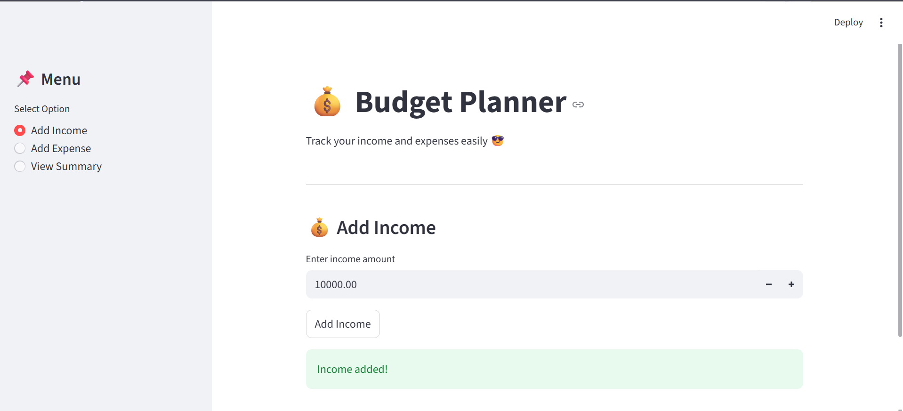
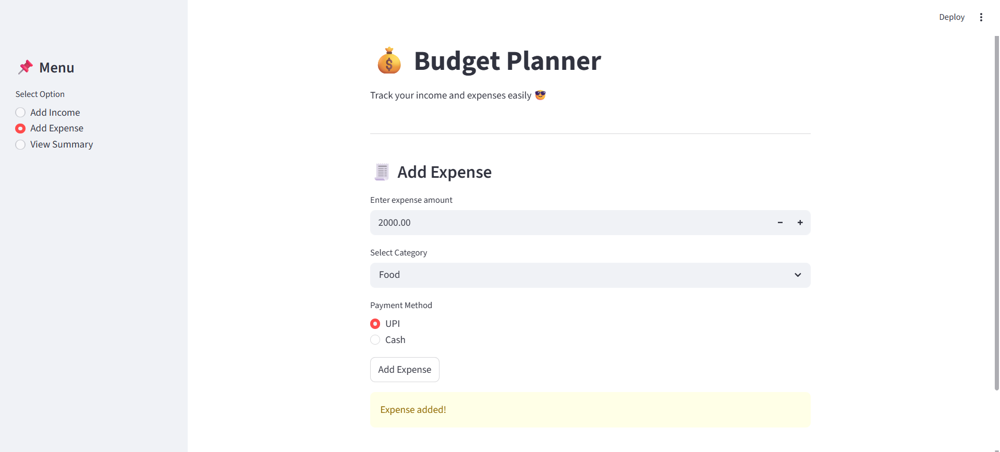
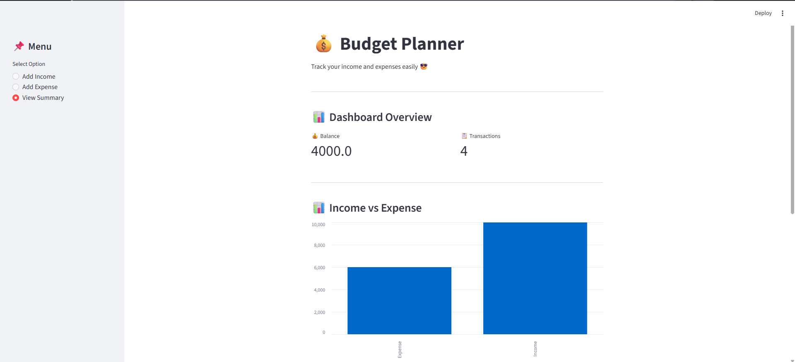
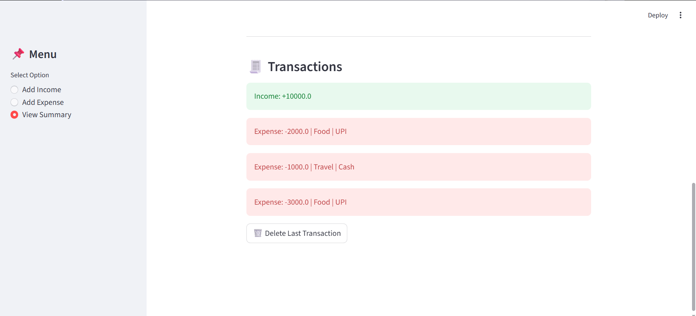

# budget-planner-app
A budget planner web app built using streamlit.

# 💰 Budget Planner App

A simple and interactive budget planner built using Streamlit.

## 🚀 Features
- Add Income
- Add Expense with Category & Payment Method
- View Balance
- Transaction History
- Income vs Expense Graph
- Delete Last Transaction

## 🛠️ Tech Used
- Python
- Streamlit

## ▶️ How to Run
pip install streamlit
streamlit run app.py

## 📸 Screenshots

